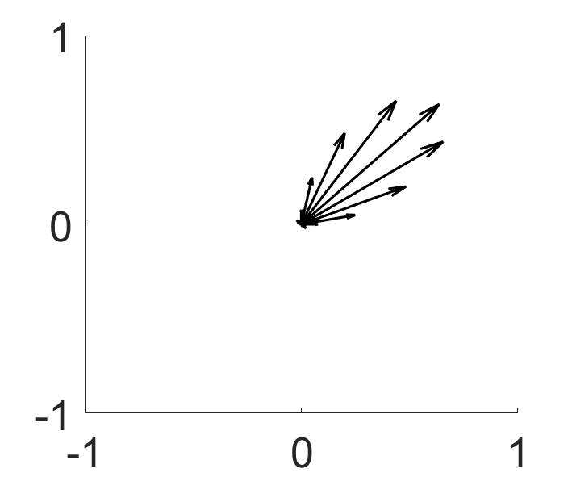
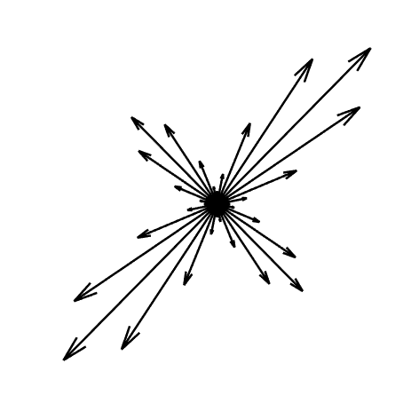
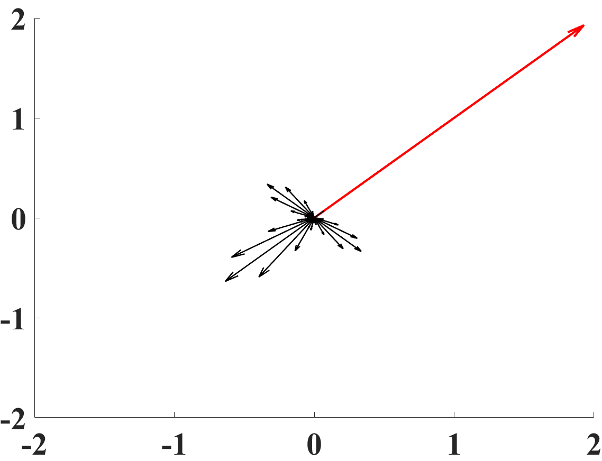
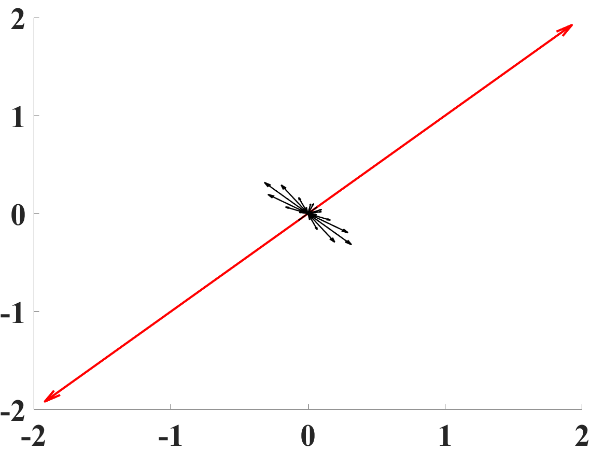
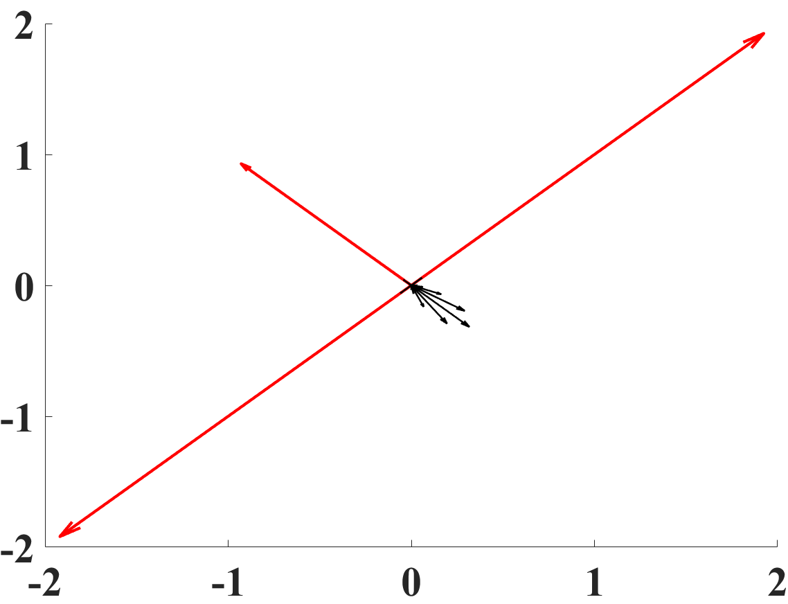
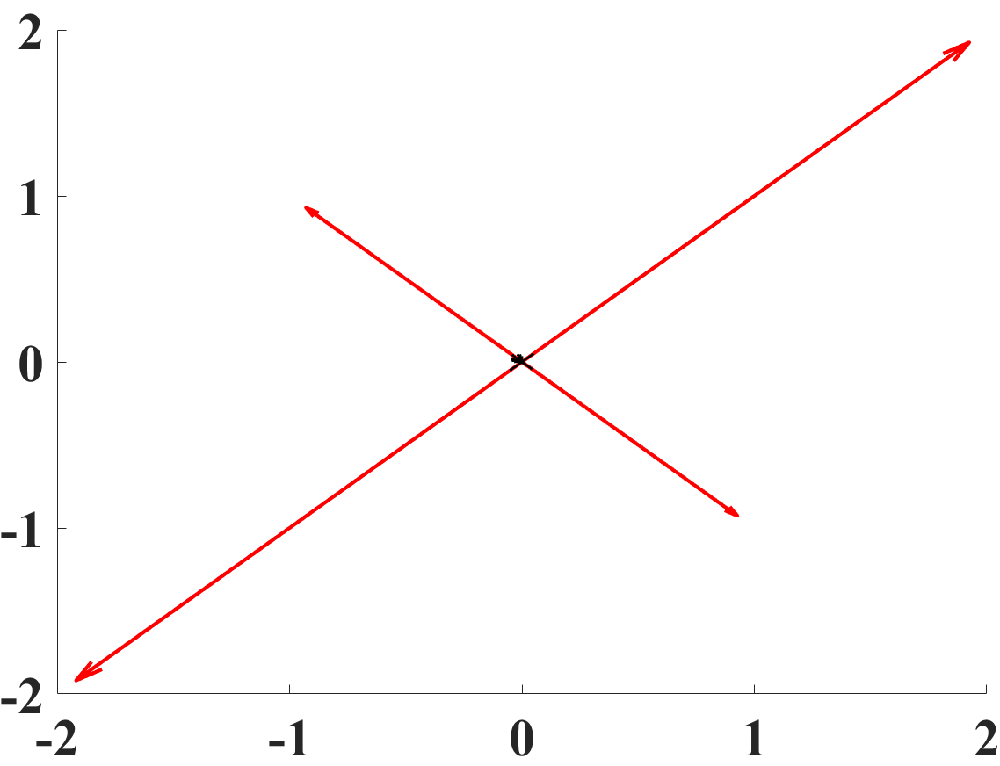
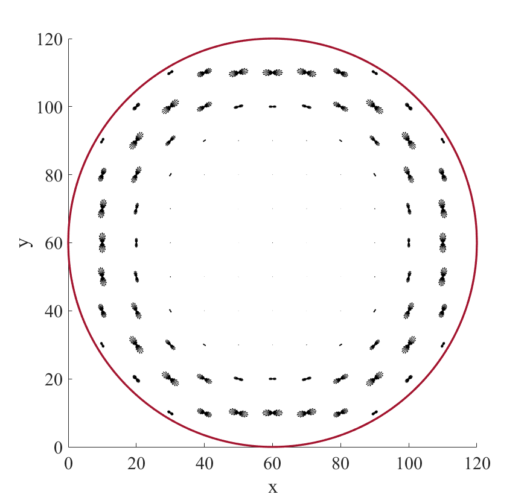
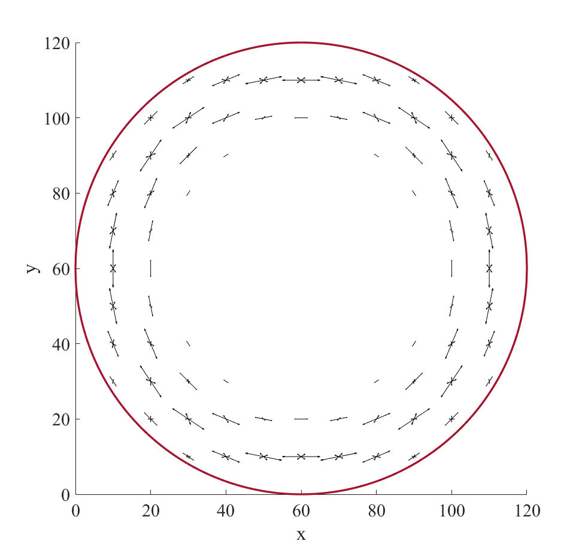
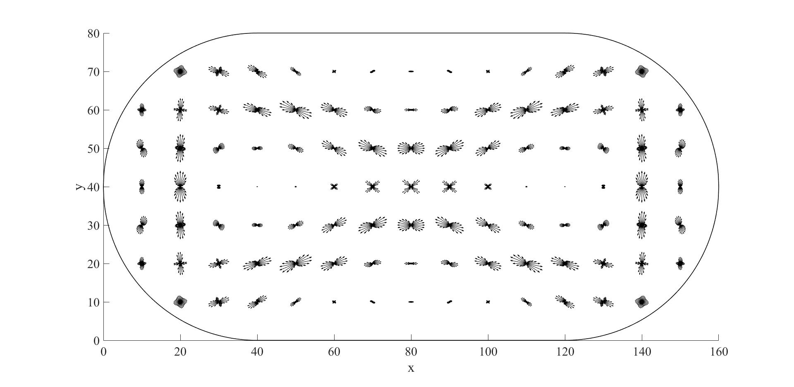
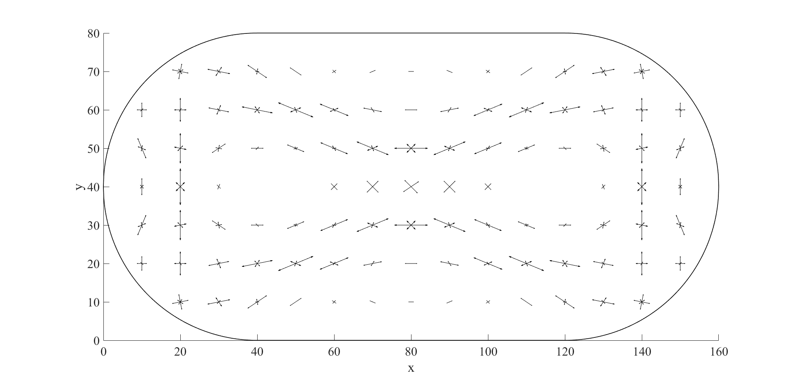

# RESULTS SHOW

## Directory

    ├─circular system
    │  ├─harmonic
    │  ├─magnetic
    │  └─well
    ├─figure
    ├─HusimiMap
    └─stadium system

## Plain wave

- Setting Code
  
```matlab
    N = 32; % the number of test wavevector
    Nx = 1:121; % x-axios
    Ny = 1:121; % y-axios
    delta_k = 0.3; % momentum uncertainty
        ....
    PisType = 'A'; % the type of wave packet
    isShow = true; % Show wave function

    r0 = [60, 60]; % test position
````

- Raw Husimi Map


## MMA

```matlab
    N = 32; % the number of test wavevector
    M = 32; % the number of templates
    Nx = 1:121; % x-axios
    Ny = 1:121; % y-axios
    delta_k = 0.3; % momentum uncertainty
    isShow = true;

    r0 = [55, 55]; % test position
        ....
    sigma = 0.5 / delta_k;
````

- Raw Husimi Map


- Processed Husimi Map





## Circular System

- Setting Code

```matlab
    delta_k = 0.1; % momentum uncertainty
    R = 65; % system radius
    % Type: well, harmonic, magnetic
    Type = 'well';
    isWaveFun = 'off';
            ....
    % setting parameter
    des_level = 91;
````

- Raw Husimi Map

- Processed Husimi Map


## Stadium System

```matlab
    delta_k = 0.1; % momentum uncertainty
    R = 40; % system radius
    % Type: well, harmonic, magnetic
    isWaveFun = 'on';
        ...
    % setting parameter
    des_level = 74;
````

- Raw Husimi Map

- Processed Husimi Map

